# Database Entity Relationship Diagram

## Complete Schema Diagram

```mermaid
erDiagram
    tenants {
        varchar tenant_id PK "ten-xxxxxxxx-xxxxxxxx"
        varchar name "Organization name"
        varchar email "Contact email"
        integer quota "Monthly token quota"
        tinyint active "Active status"
        varchar api_key "Legacy API key (deprecated)"
        varchar plan_code "Subscription plan"
        varchar subscription_status "Active/Inactive/Trial"
        datetime trial_ends_at "Trial expiration"
        datetime subscription_ends_at "Subscription end"
        integer max_domains "Max allowed domains"
        integer max_api_keys "Max API keys allowed"
        tinyint auto_create_users "Auto-create API users"
        datetime created_at
        datetime updated_at
    }

    buttons {
        integer id PK "Auto increment"
        varchar button_id UK "btn-xxx"
        varchar tenant_id FK "References tenants"
        varchar name "Button display name"
        text description "Purpose description"
        varchar domain "Authorized domain"
        text system_prompt "AI system prompt"
        varchar provider "openai/anthropic/etc"
        varchar model "gpt-4/claude-3/etc"
        varchar api_key_id FK "References api_keys"
        varchar status "active/inactive"
        tinyint auto_create_api_users "Auto-create users flag"
        datetime created_at
        datetime updated_at
    }

    api_keys {
        varchar api_key_id PK "key-xxx"
        varchar tenant_id FK "References tenants"
        varchar name "Descriptive name"
        varchar provider "openai/anthropic/etc"
        varchar api_key "Encrypted key"
        tinyint is_default "Default for provider"
        tinyint active "Active status"
        datetime created_at
        datetime updated_at
    }

    api_users {
        varchar user_id PK "usr-xxx"
        varchar tenant_id FK "References tenants"
        varchar external_id "External system ID"
        varchar name "User name (optional)"
        varchar email "User email (optional)"
        integer quota "Monthly quota override"
        integer daily_quota "Daily quota limit"
        tinyint active "Active status"
        datetime created_at
        datetime updated_at
        datetime last_activity "Last API usage"
    }

    usage_logs {
        integer id PK "Auto increment"
        varchar usage_id UK "usage-xxx"
        varchar tenant_id FK "References tenants"
        integer user_id "Legacy user ID"
        varchar external_id "External user ID"
        varchar button_id FK "References buttons"
        varchar provider "Used provider"
        varchar model "Used model"
        integer tokens "Total tokens consumed"
        decimal cost "Calculated cost"
        tinyint has_image "Request had images"
        varchar status "success/error"
        datetime created_at
        datetime updated_at
    }

    domains {
        varchar domain_id PK "Unique identifier"
        varchar tenant_id FK "References tenants"
        varchar domain "Domain name"
        tinyint verified "Verification status"
        datetime created_at
    }

    users {
        integer id PK "Auto increment"
        varchar username UK "Login username"
        varchar email UK "User email"
        varchar password "Hashed password"
        varchar name "Full name"
        varchar role "admin/superadmin"
        varchar tenant_id FK "References tenants (if tenant admin)"
        tinyint active "Active status"
        integer quota "Assigned quota"
        datetime last_login "Last login time"
        datetime created_at
        datetime updated_at
    }

    api_tokens {
        integer id PK "Auto increment"
        integer user_id FK "References users"
        varchar tenant_id FK "References tenants"
        varchar name "Token name"
        varchar token "Access token"
        varchar refresh_token "Refresh token"
        text scopes "Token permissions"
        datetime last_used_at "Last usage"
        datetime expires_at "Expiration date"
        tinyint revoked "Revocation status"
        datetime created_at
        datetime updated_at
    }

    tenant_users {
        integer id PK "Auto increment"
        varchar tenant_id FK "References tenants"
        varchar user_id "User identifier"
        varchar name "User full name"
        varchar email "User email"
        integer quota "Assigned quota"
        tinyint active "Active status"
        datetime created_at
        datetime updated_at
    }

    plans {
        integer id PK "Auto increment"
        varchar name "Plan name"
        varchar code UK "Plan code"
        decimal price "Monthly price"
        integer requests_limit "Request limit"
        integer users_limit "User limit"
        text features "Features JSON"
        datetime created_at
        datetime updated_at
    }

    user_quotas {
        varchar tenant_id PK,FK "References tenants"
        varchar external_id PK "External user ID"
        integer total_quota "Custom quota"
        datetime created_at
    }

    migrations {
        integer id PK "Auto increment"
        varchar version "Migration version"
        varchar class "Migration class"
        varchar group "Migration group"
        varchar namespace "Class namespace"
        integer time "Execution timestamp"
        integer batch "Execution batch"
    }

    %% Relationships
    tenants ||--o{ buttons : "has many"
    tenants ||--o{ api_keys : "owns"
    tenants ||--o{ api_users : "contains"
    tenants ||--o{ domains : "authorizes"
    tenants ||--o{ usage_logs : "generates"
    tenants ||--o{ tenant_users : "administers"
    tenants ||--o{ user_quotas : "assigns quotas"
    tenants }o--|| plans : "subscribes to"
    tenants }o--o| users : "administered by"

    buttons }o--|| api_keys : "uses"
    buttons ||--o{ usage_logs : "creates"

    api_users ||--o{ usage_logs : "consumes"
    api_users }o--o| user_quotas : "has custom quota"

    users ||--o{ api_tokens : "owns"

    api_tokens }o--|| tenants : "scoped to"
```



## Table Relationships Summary

### Primary Flows

1. **Tenant Management Flow**
   ```
   plans → tenants → (api_keys, domains, buttons, api_users)
   ```

2. **API Request Flow**
   ```
   domains → buttons → api_keys → usage_logs
   api_users → usage_logs
   ```

3. **Administration Flow**
   ```
   users → api_tokens → tenants → tenant_users
   ```

### Key Constraints

- **tenant_id**: Central identifier linking most entities
- **button_id**: Links configuration to usage logs
- **external_id**: Links external users to usage tracking
- **domain validation**: CORS security through domains table

### Indexing Strategy

```sql
-- High-performance indexes for common queries
CREATE INDEX idx_usage_logs_tenant_external ON usage_logs(tenant_id, external_id);
CREATE INDEX idx_usage_logs_created_at ON usage_logs(created_at);
CREATE INDEX idx_api_users_tenant_external ON api_users(tenant_id, external_id);
CREATE INDEX idx_buttons_tenant_status ON buttons(tenant_id, status);
```