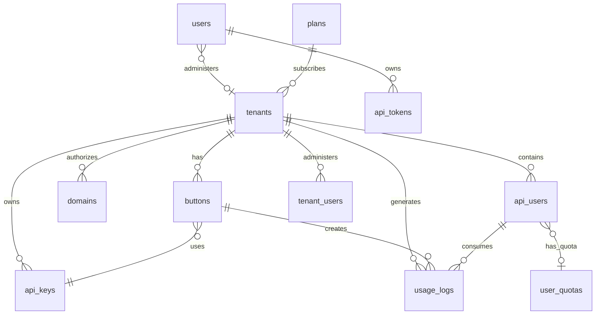

# AI Text Enhancer Proxy - Database Schema Documentation

Esta documentación describe la estructura completa de la base de datos del sistema AI Text Enhancer Proxy, incluyendo todas las tablas, relaciones, índices y constrains.

## 📋 Índice

- [Resumen General](#resumen-general)
- [Diagrama de Relaciones](#diagrama-de-relaciones)
- [Tablas del Sistema](#tablas-del-sistema)
- [Índices y Constraints](#índices-y-constraints)
- [Relaciones entre Tablas](#relaciones-entre-tablas)
- [Datos de Ejemplo](#datos-de-ejemplo)

## 🎯 Resumen General

La base de datos utiliza **SQLite** y sigue un diseño multi-tenant que permite:

- **Multi-tenancy**: Múltiples organizaciones independientes
- **Gestión de Usuarios**: Usuarios administrativos y usuarios de API
- **Control de Cuotas**: Límites de uso por usuario y tenant
- **Configuración Flexible**: Botones configurables por tenant
- **Logging Completo**: Registro detallado de uso para facturación
- **Autenticación**: Múltiples métodos de autenticación

## 📊 Diagrama de Relaciones



## 🗄 Tablas del Sistema

### 1. 🏢 **tenants** - Organizaciones/Inquilinos

Tabla principal que representa cada organización o cliente del sistema.

```sql
CREATE TABLE `tenants` (
    `tenant_id` VARCHAR NOT NULL,           -- Identificador único (ten-xxxxxxxx-xxxxxxxx)
    `name` VARCHAR NOT NULL,                -- Nombre de la organización
    `email` VARCHAR NOT NULL,               -- Email de contacto
    `quota` INTEGER NOT NULL,               -- Cuota total mensual
    `active` TINYINT NOT NULL,              -- Estado activo (0/1)
    `api_key` VARCHAR NULL,                 -- API key heredada (deprecated)
    `plan_code` VARCHAR NULL,               -- Código del plan contratado
    `subscription_status` VARCHAR NULL,     -- Estado de suscripción
    `trial_ends_at` DATETIME NULL,          -- Fin del período de prueba
    `subscription_ends_at` DATETIME NULL,   -- Fin de la suscripción
    `max_domains` INTEGER NOT NULL,         -- Máximo dominios permitidos
    `max_api_keys` INTEGER NOT NULL,        -- Máximo API keys permitidas
    `auto_create_users` TINYINT NOT NULL,   -- Auto-crear usuarios de API
    `created_at` DATETIME NOT NULL,
    `updated_at` DATETIME NOT NULL,
    CONSTRAINT `pk_tenants` PRIMARY KEY(`tenant_id`)
);
```

**Propósito**: Control de facturación, límites y configuración global por organización.

### 2. 🔘 **buttons** - Configuraciones de Botones

Cada botón representa una configuración específica de modelo y prompt para un tenant.

```sql
CREATE TABLE `buttons` (
    `id` INTEGER PRIMARY KEY AUTOINCREMENT,
    `button_id` VARCHAR NOT NULL UNIQUE,    -- Identificador único (btn-xxx)
    `tenant_id` VARCHAR NOT NULL,           -- FK a tenants
    `name` VARCHAR NOT NULL,                -- Nombre descriptivo
    `description` TEXT NULL,                -- Descripción del propósito
    `domain` VARCHAR NOT NULL,              -- Dominio autorizado
    `system_prompt` TEXT NULL,              -- Prompt del sistema
    `provider` VARCHAR NOT NULL,            -- Proveedor (openai, anthropic, etc.)
    `model` VARCHAR NOT NULL,               -- Modelo específico (gpt-4, claude-3, etc.)
    `api_key_id` VARCHAR NOT NULL,          -- FK a api_keys
    `status` VARCHAR NOT NULL,              -- Estado (active, inactive)
    `auto_create_api_users` TINYINT NULL,   -- Auto-crear usuarios en primer uso
    `created_at` DATETIME NOT NULL,
    `updated_at` DATETIME NOT NULL
);
```

**Propósito**: Configuración específica por caso de uso, permite diferentes modelos y prompts.

### 3. 🔑 **api_keys** - Claves de API de Proveedores

Almacena las API keys encriptadas para cada proveedor de LLM.

```sql
CREATE TABLE `api_keys` (
    `api_key_id` VARCHAR NOT NULL,          -- Identificador único (key-xxx)
    `tenant_id` VARCHAR NOT NULL,           -- FK a tenants
    `name` VARCHAR NOT NULL,                -- Nombre descriptivo
    `provider` VARCHAR NOT NULL,            -- Proveedor (openai, anthropic, etc.)
    `api_key` VARCHAR NOT NULL,             -- Clave encriptada
    `is_default` TINYINT NOT NULL,          -- Clave por defecto para el proveedor
    `active` TINYINT NOT NULL,              -- Estado activo
    `created_at` DATETIME NOT NULL,
    `updated_at` DATETIME NOT NULL,
    CONSTRAINT `pk_api_keys` PRIMARY KEY(`api_key_id`)
);
```

**Propósito**: Gestión segura de credenciales de proveedores externos.

### 4. 👥 **api_users** - Usuarios de API

Usuarios finales que consumen el API a través de los componentes.

```sql
CREATE TABLE `api_users` (
    `user_id` VARCHAR NOT NULL,             -- Identificador único (usr-xxx)
    `tenant_id` VARCHAR NOT NULL,           -- FK a tenants
    `external_id` VARCHAR NULL,             -- ID del usuario en sistema externo
    `name` VARCHAR NULL,                    -- Nombre del usuario (opcional)
    `email` VARCHAR NULL,                   -- Email del usuario (opcional)
    `quota` INTEGER NULL,                   -- Cuota mensual específica
    `daily_quota` INTEGER NOT NULL DEFAULT 10000, -- Cuota diaria
    `active` TINYINT NOT NULL DEFAULT 1,    -- Estado activo
    `created_at` DATETIME NOT NULL,
    `updated_at` DATETIME NOT NULL,
    `last_activity` DATETIME NULL,          -- Última actividad registrada
    CONSTRAINT `pk_api_users` PRIMARY KEY(`user_id`)
);
```

**Propósito**: Control de acceso y cuotas por usuario final.

### 5. 📊 **usage_logs** - Registro de Uso

Log detallado de cada request procesado para facturación y análisis.

```sql
CREATE TABLE `usage_logs` (
    `id` INTEGER PRIMARY KEY AUTOINCREMENT,
    `usage_id` VARCHAR NOT NULL UNIQUE,     -- Identificador único (usage-xxx)
    `tenant_id` VARCHAR NOT NULL,           -- FK a tenants
    `user_id` INTEGER NULL,                 -- Legacy user ID
    `external_id` VARCHAR NULL,             -- ID del usuario externo
    `button_id` VARCHAR NULL,               -- FK a buttons
    `provider` VARCHAR NOT NULL,            -- Proveedor utilizado
    `model` VARCHAR NOT NULL,               -- Modelo utilizado
    `tokens` INTEGER NOT NULL,              -- Total de tokens consumidos
    `cost` DECIMAL NULL,                    -- Costo calculado
    `has_image` TINYINT NULL,               -- Request incluía imágenes
    `status` VARCHAR NOT NULL,              -- Estado (success, error)
    `created_at` DATETIME NOT NULL,
    `updated_at` DATETIME NOT NULL
);
```

**Propósito**: Auditoría, facturación y análisis de uso.

### 6. 🌐 **domains** - Dominios Autorizados

Dominios autorizados para cada tenant (validación CORS).

```sql
CREATE TABLE `domains` (
    `domain_id` VARCHAR NOT NULL,           -- Identificador único
    `tenant_id` VARCHAR NOT NULL,           -- FK a tenants
    `domain` VARCHAR NOT NULL,              -- Dominio (example.com)
    `verified` TINYINT NOT NULL DEFAULT 0,  -- Dominio verificado
    `created_at` DATETIME NOT NULL,
    CONSTRAINT `pk_domains` PRIMARY KEY(`domain_id`)
);
```

**Propósito**: Seguridad y control de acceso por origen.

### 7. 👨‍💼 **users** - Usuarios Administrativos

Usuarios que acceden al panel de administración.

```sql
CREATE TABLE `users` (
    `id` INTEGER PRIMARY KEY AUTOINCREMENT,
    `username` VARCHAR NOT NULL UNIQUE,     -- Nombre de usuario
    `email` VARCHAR NOT NULL UNIQUE,        -- Email único
    `password` VARCHAR NOT NULL,            -- Contraseña hasheada
    `name` VARCHAR NOT NULL,                -- Nombre completo
    `role` VARCHAR NOT NULL,                -- Rol (admin, superadmin)
    `tenant_id` VARCHAR NULL,               -- FK a tenants (si es admin de tenant)
    `active` TINYINT NOT NULL,              -- Estado activo
    `quota` INTEGER NULL,                   -- Cuota asignada
    `last_login` DATETIME NULL,             -- Último login
    `created_at` DATETIME NOT NULL,
    `updated_at` DATETIME NOT NULL
);
```

**Propósito**: Autenticación y autorización para el panel admin.

### 8. 🎫 **api_tokens** - Tokens de API

Tokens de autenticación para usuarios administrativos.

```sql
CREATE TABLE `api_tokens` (
    `id` INTEGER PRIMARY KEY AUTOINCREMENT,
    `user_id` INTEGER NOT NULL,             -- FK a users
    `tenant_id` VARCHAR NULL,               -- FK a tenants
    `name` VARCHAR NOT NULL,                -- Nombre del token
    `token` VARCHAR NOT NULL,               -- Token de acceso
    `refresh_token` VARCHAR NOT NULL,       -- Token de refresco
    `scopes` TEXT NULL,                     -- Permisos del token
    `last_used_at` DATETIME NULL,           -- Último uso
    `expires_at` DATETIME NULL,             -- Fecha de expiración
    `revoked` TINYINT NOT NULL DEFAULT 0,   -- Token revocado
    `created_at` DATETIME NOT NULL,
    `updated_at` DATETIME NOT NULL
);
```

**Propósito**: Autenticación por tokens para API administrativa.

### 9. 👥 **tenant_users** - Usuarios de Tenant

Usuarios con acceso administrativo a un tenant específico.

```sql
CREATE TABLE `tenant_users` (
    `id` INTEGER PRIMARY KEY AUTOINCREMENT,
    `tenant_id` VARCHAR NOT NULL,           -- FK a tenants
    `user_id` VARCHAR NOT NULL,             -- Identificador del usuario
    `name` VARCHAR NOT NULL,                -- Nombre del usuario
    `email` VARCHAR NULL,                   -- Email del usuario
    `quota` INTEGER NOT NULL,               -- Cuota asignada
    `active` TINYINT NOT NULL,              -- Estado activo
    `created_at` DATETIME NOT NULL,
    `updated_at` DATETIME NOT NULL
);
```

**Propósito**: Gestión de usuarios administrativos por tenant.

### 10. 📋 **plans** - Planes de Suscripción

Definición de planes comerciales disponibles.

```sql
CREATE TABLE `plans` (
    `id` INTEGER PRIMARY KEY AUTOINCREMENT,
    `name` VARCHAR NOT NULL,                -- Nombre del plan
    `code` VARCHAR NOT NULL UNIQUE,         -- Código único
    `price` DECIMAL NOT NULL,               -- Precio mensual
    `requests_limit` INTEGER NOT NULL,      -- Límite de requests
    `users_limit` INTEGER NOT NULL,         -- Límite de usuarios
    `features` TEXT NULL,                   -- Características (JSON)
    `created_at` DATETIME NOT NULL,
    `updated_at` DATETIME NOT NULL
);
```

**Propósito**: Definición de planes comerciales y límites.

### 11. 📊 **user_quotas** - Cuotas de Usuario

Cuotas específicas por usuario (tabla complementaria).

```sql
CREATE TABLE `user_quotas` (
    `tenant_id` VARCHAR NOT NULL,           -- FK a tenants
    `external_id` VARCHAR NOT NULL,         -- ID del usuario externo
    `total_quota` INTEGER NOT NULL,         -- Cuota total asignada
    `created_at` DATETIME NOT NULL,
    CONSTRAINT `pk_user_quotas` PRIMARY KEY(`tenant_id`, `external_id`)
);
```

**Propósito**: Cuotas personalizadas por usuario específico.

### 12. 🗃 **migrations** - Control de Migraciones

Control de versiones de la base de datos.

```sql
CREATE TABLE `migrations` (
    `id` INTEGER PRIMARY KEY AUTOINCREMENT,
    `version` VARCHAR NOT NULL,             -- Versión de la migración
    `class` VARCHAR NOT NULL,               -- Clase de la migración
    `group` VARCHAR NOT NULL,               -- Grupo de migración
    `namespace` VARCHAR NOT NULL,           -- Namespace de la clase
    `time` INT NOT NULL,                    -- Timestamp de ejecución
    `batch` INT NOT NULL                    -- Lote de ejecución
);
```

**Propósito**: Control de versiones y estado de migraciones.

## 🔗 Índices y Constraints

### Índices Únicos

```sql
-- Usuarios únicos
CREATE UNIQUE INDEX `users_username` ON `users` (`username`);
CREATE UNIQUE INDEX `users_email` ON `users` (`email`);

-- Botones únicos
CREATE UNIQUE INDEX `buttons_button_id` ON `buttons` (`button_id`);

-- Tenant users únicos
CREATE UNIQUE INDEX `tenant_users_user_id` ON `tenant_users` (`user_id`);

-- Dominios únicos por tenant
CREATE UNIQUE INDEX `domains_tenant_id_domain` ON `domains` (`tenant_id`, `domain`);

-- Plans únicos
CREATE UNIQUE INDEX `plans_code` ON `plans` (`code`);

-- Usage logs únicos
CREATE UNIQUE INDEX `usage_logs_usage_id` ON `usage_logs` (`usage_id`);
```

### Claves Primarias

- **tenants**: `tenant_id` (VARCHAR)
- **api_keys**: `api_key_id` (VARCHAR)
- **domains**: `domain_id` (VARCHAR)
- **api_users**: `user_id` (VARCHAR)
- **user_quotas**: Clave compuesta (`tenant_id`, `external_id`)
- **Otras tablas**: ID autoincremental

## 🔄 Relaciones entre Tablas

### Relaciones Principales

1. **tenants** → **buttons** (1:N)
   - Un tenant puede tener múltiples botones

2. **tenants** → **api_keys** (1:N)
   - Un tenant puede tener múltiples API keys por proveedor

3. **tenants** → **api_users** (1:N)
   - Un tenant puede tener múltiples usuarios de API

4. **tenants** → **domains** (1:N)
   - Un tenant puede autorizar múltiples dominios

5. **buttons** → **api_keys** (N:1)
   - Cada botón usa una API key específica

6. **api_users** → **usage_logs** (1:N)
   - Un usuario genera múltiples registros de uso

### Integridad Referencial

**Nota**: SQLite no aplica foreign keys por defecto, pero las relaciones lógicas son:

```sql
-- Relaciones lógicas (no aplicadas físicamente)
buttons.tenant_id → tenants.tenant_id
buttons.api_key_id → api_keys.api_key_id
api_keys.tenant_id → tenants.tenant_id
api_users.tenant_id → tenants.tenant_id
usage_logs.tenant_id → tenants.tenant_id
domains.tenant_id → tenants.tenant_id
```

## 📝 Datos de Ejemplo

### Tenant Ejemplo

```sql
INSERT INTO tenants VALUES (
    'ten-684cc05b-5d6457e5',
    'Demo Company',
    'demo@example.com',
    50000,              -- quota mensual
    1,                  -- active
    NULL,               -- api_key legacy
    'premium',          -- plan_code
    'active',           -- subscription_status
    NULL,               -- trial_ends_at
    '2024-12-31 23:59:59', -- subscription_ends_at
    5,                  -- max_domains
    3,                  -- max_api_keys
    1,                  -- auto_create_users
    '2024-01-01 00:00:00',
    '2024-01-01 00:00:00'
);
```

### API Key Ejemplo

```sql
INSERT INTO api_keys VALUES (
    'key-abc123def456',
    'ten-684cc05b-5d6457e5',
    'OpenAI Production Key',
    'openai',
    'encrypted_api_key_here',
    1,                  -- is_default
    1,                  -- active
    '2024-01-01 00:00:00',
    '2024-01-01 00:00:00'
);
```

### Botón Ejemplo

```sql
INSERT INTO buttons VALUES (
    1,
    'btn-001',
    'ten-684cc05b-5d6457e5',
    'Text Enhancer',
    'Professional content enhancement',
    'example.com',
    'You are a professional content enhancer.',
    'openai',
    'gpt-4',
    'key-abc123def456',
    'active',
    1,                  -- auto_create_api_users
    '2024-01-01 00:00:00',
    '2024-01-01 00:00:00'
);
```

## 🚀 Consideraciones de Performance

### Optimizaciones Implementadas

1. **Índices en campos de búsqueda frecuente**
2. **Claves primarias no autoincrementales** para IDs distribuidos
3. **Campos timestamp** para auditoría y particionado futuro
4. **Normalización adecuada** para evitar redundancia

### Consultas Comunes Optimizadas

```sql
-- Buscar botón por ID (índice único)
SELECT * FROM buttons WHERE button_id = 'btn-001';

-- Buscar usage por tenant y usuario (índices compuestos recomendados)
SELECT * FROM usage_logs 
WHERE tenant_id = 'ten-xxx' AND external_id = 'user123'
ORDER BY created_at DESC;

-- Verificar dominio autorizado
SELECT * FROM domains 
WHERE tenant_id = 'ten-xxx' AND domain = 'example.com';
```

## 📈 Escalabilidad y Futuras Mejoras

### Recomendaciones

1. **Particionado de usage_logs** por fecha para tablas grandes
2. **Índices compuestos** para consultas frecuentes
3. **Archivado automático** de logs antiguos
4. **Migración a PostgreSQL** para mayor concurrencia
5. **Réplicas de solo lectura** para reporting

Esta documentación proporciona una visión completa del schema de la base de datos y puede servir como referencia para desarrollo, mantenimiento y escalabilidad del sistema.